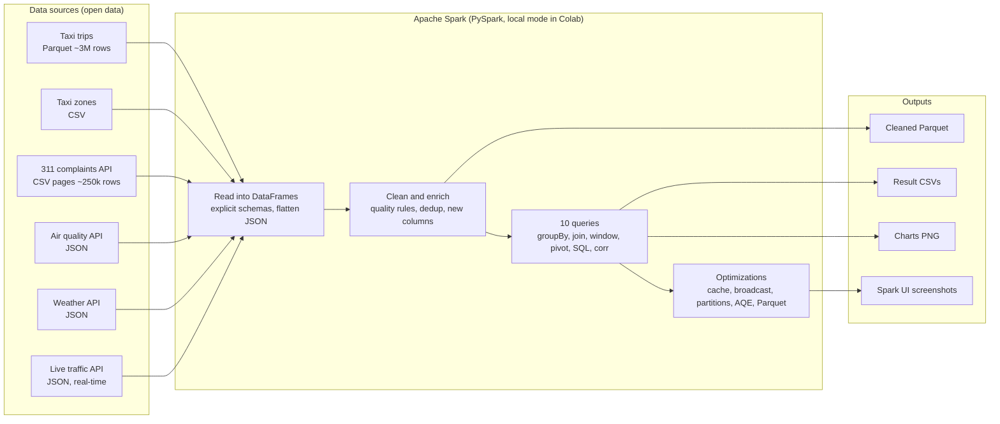

# Smart City NYC with Spark DataFrames: The Solution Explained

**Case Study 2 · Data Processing using Spark DataFrames · Unit 5.2 DataFrames · Tools: PySpark, Pandas**

| Name | Roll No |
|---|---|
| Varun Murugan | 124A8118 |
| Rankin Yanu | 124A8124 |
| Navin Nadar | 225A8134 |
| Abhay Hanchate | 225A8129 |

This document explains the whole project in plain language:
- **Part A** explains the concepts: Spark, DataFrames and the terms you will hear in the demo.
- **Part B** explains the solution step by step. For each feature it covers **what** we do, **how** we do it, **why** we do it, and **what** we use.

The code itself is in `notebooks/Spark_DataFrames_CaseStudy.ipynb`.

---

## Contents

- [Part A — Concepts](#part-a--concepts)
  - [A1. The problem Spark solves](#a1-the-problem-spark-solves)
  - [A2. Apache Spark and PySpark](#a2-apache-spark-and-pyspark)
  - [A3. How Spark runs: driver, executors, cluster, local mode](#a3-how-spark-runs-driver-executors-cluster-local-mode)
  - [A4. The DataFrame](#a4-the-dataframe)
  - [A5. Partitions, tasks, stages, jobs](#a5-partitions-tasks-stages-jobs)
  - [A6. Transformations, actions and lazy evaluation](#a6-transformations-actions-and-lazy-evaluation)
  - [A7. Narrow vs wide transformations and the shuffle](#a7-narrow-vs-wide-transformations-and-the-shuffle)
  - [A8. The query optimizer and execution plans](#a8-the-query-optimizer-and-execution-plans)
  - [A9. File formats: CSV, JSON, Parquet](#a9-file-formats-csv-json-parquet)
  - [A10. Other terms used in the project](#a10-other-terms-used-in-the-project)
- [Part B — The solution](#part-b--the-solution)
  - [B1. The idea in one paragraph](#b1-the-idea-in-one-paragraph)
  - [B2. Architecture](#b2-architecture)
  - [B3. The data sources and why we chose them](#b3-the-data-sources-and-why-we-chose-them)
  - [B4. Step 1 — Setup](#b4-step-1--setup)
  - [B5. Step 2 — Loading the data](#b5-step-2--loading-the-data)
  - [B6. Step 3 — Distributed processing](#b6-step-3--distributed-processing)
  - [B7. Step 4 — Cleaning (transformations and actions)](#b7-step-4--cleaning-transformations-and-actions)
  - [B8. Step 4 — The 10 queries](#b8-step-4--the-10-queries)
  - [B9. Step 5 — Performance optimizations](#b9-step-5--performance-optimizations)
  - [B10. Step 6 — Capturing results](#b10-step-6--capturing-results)
  - [B11. Step 7 — Performance analysis](#b11-step-7--performance-analysis)
  - [B12. Tools and technologies](#b12-tools-and-technologies)
  - [B13. How the project meets the evaluation criteria](#b13-how-the-project-meets-the-evaluation-criteria)
  - [B14. Limitations and next steps](#b14-limitations-and-next-steps)
  - [B15. Likely viva questions with short answers](#b15-likely-viva-questions-with-short-answers)

---

# Part A — Concepts

## A1. The problem Spark solves

A normal Python program, including Pandas, runs on **one machine** and mostly uses **one CPU core**. It also needs the
**whole dataset in RAM**. That is fine for thousands of rows. It becomes a problem when data grows to millions or
billions of rows:
- the data does not fit in memory, and
- one core takes too long to process it.

The fix is **distributed processing**:
1. Split the data into pieces.
2. Process the pieces at the same time on many cores or many machines.
3. Combine the results.

Doing this by hand is hard: you would have to handle splitting, scheduling, failures and moving data between
machines. **Apache Spark** does all of this for you.

## A2. Apache Spark and PySpark

- **Apache Spark** is an open-source engine for processing large datasets in parallel. You describe *what* you want
  (filter these rows, group by that column) and Spark decides *how* to run it across the available cores or machines.
  It keeps data **in memory** between steps where possible, which makes it much faster than older disk-based systems
  such as Hadoop MapReduce.
- **PySpark** is the Python library for Spark. We write normal Python, and PySpark sends the work to Spark's engine.
  Spark's engine runs on the **Java Virtual Machine (JVM)**, which is why Java must be installed.
- **Spark SQL** is the Spark module for structured data (tables with columns). DataFrames and SQL queries are both
  part of Spark SQL.

## A3. How Spark runs: driver, executors, cluster, local mode

| Term | Meaning |
|---|---|
| **Driver** | The main program (our notebook). It builds the plan, splits it into tasks and collects results. |
| **Executor** | A worker process that runs tasks on its share of the data. On a cluster there are many executors on many machines. |
| **Cluster manager** | Starts executors on machines. Examples: Spark Standalone, YARN, Kubernetes. |
| **Local mode** | Driver and executors run inside **one machine**. Each CPU core acts as a parallel worker. `local[*]` means "use all cores", `local[1]` means "use 1 core". **We use local mode**, in Google Colab or on a laptop. |
| **SparkSession** | The entry point to Spark in code. `spark.read...`, `spark.sql(...)` and `spark.createDataFrame(...)` all go through it. |
| **Spark UI** | A web dashboard (port 4040) that shows every job, stage, task, cached data and query plan. We use it for screenshots. |

**Key point:** the same code runs in local mode and on a 100-machine cluster. Only the `master` setting changes
(`local[*]` → `spark://...` or `k8s://...`).

## A4. The DataFrame

A **DataFrame** is a table of data with **named columns** and a **type for each column**, like a spreadsheet or a
database table. In Spark it is also:

- **Distributed:** the rows are split into partitions that can live on different cores or machines.
- **Immutable:** you never change a DataFrame in place. Each operation returns a *new* DataFrame.
- **Lazy:** a DataFrame is a *recipe* for producing data, not the data itself. Nothing is computed until you ask for
  a result (see A6).
- **Optimized:** because Spark knows the columns and types, it can optimize your query before running it (see A8).

**Spark DataFrame vs Pandas DataFrame**

| | Pandas DataFrame | Spark DataFrame |
|---|---|---|
| Where the data lives | Fully in one machine's RAM | Split into partitions across cores or machines |
| Execution | Immediate (eager) | Lazy: runs only when an action is called |
| Parallelism | Mostly one core | All cores, or all machines in a cluster |
| Best for | Small to medium data, quick analysis, plotting | Large data, production pipelines |
| In our project | Displaying small results and drawing charts | All the heavy processing |

**Schema:** the list of column names and types, for example `fare_amount: double`. We give Spark **explicit schemas**
for CSV files. Spark then does not have to guess the types (`inferSchema`), which would need an extra pass over the data.

## A5. Partitions, tasks, stages, jobs

| Term | Meaning | Example in our project |
|---|---|---|
| **Partition** | One piece of a DataFrame. Spark processes partitions in parallel. | The 3M taxi rows are read as 4 partitions on a 4-core machine. |
| **Task** | The work done on **one partition** by one core. | 4 partitions → 4 tasks run at the same time. |
| **Stage** | A group of tasks that can run without moving data between partitions. A new stage starts at every shuffle (see A7). | A `groupBy` query has 2 stages: before and after the shuffle. |
| **Job** | All the stages needed to answer one **action**. | Each `count()` or `toPandas()` starts a job. |
| **DAG** | *Directed Acyclic Graph*: the graph of stages Spark builds for a job. The Spark UI draws it. | |

## A6. Transformations, actions and lazy evaluation

| | What it does | Examples |
|---|---|---|
| **Transformation** | Describes a new DataFrame from an existing one. **Nothing runs yet.** | `select`, `filter`, `withColumn`, `join`, `groupBy().agg()`, `orderBy`, `dropDuplicates` |
| **Action** | Asks for a result, so Spark **actually runs** all the transformations needed. | `count`, `show`, `collect`, `toPandas`, `write` |

**Lazy evaluation** means Spark waits until an action before doing any work. This lets it look at the **whole chain**
of steps and optimize it. For example, it can skip columns you never use, or apply filters as early as possible.

In the notebook we prove this:
- Defining the full cleaning pipeline takes about **0.2 seconds**, because nothing runs.
- The `count()` action takes about **1.2 seconds**, because that is when all the work happens.

## A7. Narrow vs wide transformations and the shuffle

- **Narrow transformation:** each output partition needs data from only **one** input partition, so no data has to
  move. Examples: `filter`, `select`, `withColumn`. These are cheap.
- **Wide transformation:** output rows need data from **many** input partitions. For example, to count trips per
  hour, all rows for hour 18 must end up in the same place. Examples: `groupBy`, `join`, `orderBy`, `distinct`,
  `repartition`.
- **Shuffle:** the data movement that a wide transformation causes. Rows are written out, sent across the network or
  between cores, and read back, grouped by key. Shuffles are the **most expensive** part of most Spark jobs, so many
  optimizations aim to avoid or shrink them.

## A8. The query optimizer and execution plans

- **Catalyst** is Spark's query optimizer. It rewrites your DataFrame or SQL code into an efficient plan. For example,
  it pushes filters down to the file reader, removes unused columns, and picks a join strategy.
- **Logical plan:** *what* to compute. **Physical plan:** *how* to compute it (which join algorithm, where the shuffles
  are).
- `df.explain()` prints the physical plan. In it, **`Exchange`** means a shuffle, and **`BroadcastHashJoin`** or
  **`SortMergeJoin`** shows the join type.
- **Adaptive Query Execution (AQE):** re-optimizes the plan **while the query runs**, using real statistics. For
  example, it merges many tiny shuffle partitions into fewer bigger ones. It is on by default in Spark 3.2+.

## A9. File formats: CSV, JSON, Parquet

| Format | What it is | Pros | Cons |
|---|---|---|---|
| **CSV** | Plain text, one row per line, comma-separated | Human-readable, universal | No types; must be parsed; must read **every column** even if you need one; large |
| **JSON** | Text with nested objects and arrays | Flexible, the standard for web APIs | Same parsing cost as CSV; nested structure must be flattened |
| **Parquet** | Binary, **columnar** (values of each column stored together), compressed, with statistics | Fast, small, typed; Spark reads **only needed columns** (*column pruning*) and skips blocks using min/max statistics (*predicate pushdown*) | Not human-readable |

In our project the same taxi data is **326 MB as CSV** but **50 MB as Parquet**, and a query on Parquet is about
**8x faster**.

## A10. Other terms used in the project

| Term | Meaning |
|---|---|
| **REST API** | A web address that returns data, usually JSON, when you request it. We use 4 of them: NYC Open Data (311, live traffic) and Open-Meteo (air quality, weather). |
| **Real-time / live data** | Data that changes constantly. The NYC traffic-speed API updates every few minutes, so each run of the notebook gets the latest road speeds. |
| **Join** | Combine two DataFrames on a matching key, for example trip `PULocationID` = zone `LocationID`. |
| **Broadcast join** | A join where the small table is copied to every task, so the big table does not need to be shuffled. |
| **Sort-merge join** | The default join for two large tables: both sides are shuffled and sorted by the key, then merged. |
| **Aggregation** | Summarizing many rows into one, for example `count`, `sum`, `avg`, `min`, `max`, median. |
| **Window function** | A calculation over a group of related rows **without collapsing them**, for example "rank each complaint type within its borough" or "keep the newest reading per sensor". |
| **Pivot** | Turn the values of one column into separate columns, for example hours 0–23 become 24 columns. |
| **Cache / persist** | Keep a computed DataFrame in memory so later actions reuse it instead of recomputing it from the files. |
| **Temp view** | A name for a DataFrame so it can be queried with SQL (`createOrReplaceTempView("trips")`). |
| **`toPandas()`** | An action that collects a (small) Spark result into a Pandas DataFrame on the driver, for display and charts. |
| **Correlation (r)** | A number from −1 to +1 showing how two things move together. +1: rise together; −1: one rises when the other falls; 0: no linear relation. |
| **Median / `percentile_approx`** | The middle value. Better than the average for skewed data such as "hours to close a request". Spark computes it approximately to stay fast on big data. |
| **`noop` writer** | A Spark output that runs the whole query and then throws the result away. We use it to time queries fairly, without the time to save or collect output. |

---

# Part B — The solution

## B1. The idea in one paragraph

A **smart city** uses data from vehicles, citizens, sensors and roads to run the city better. We play the role of a
city's data team. We take **six open New York City data sources** of different types and sizes and load them into
**Spark DataFrames**:
- taxi trips (about 3 million rows)
- taxi zones
- 311 citizen complaints (about 250,000 rows)
- hourly air quality
- hourly weather
- live road-traffic speeds

We clean them, combine them by **time** and **place**, and answer **10 questions** a city operations team would ask.
Then we make the processing faster with **5 optimizations**, measure every one, compare Spark with Pandas, and test how
speed changes with the number of CPU cores.

## B2. Architecture



**Why one notebook and no web frontend?** The marks are for Spark concepts, implementation, optimization,
documentation and presentation, not for a website. A notebook shows code, explanation and output together in order,
which is the clearest way to present the work. The **Spark UI** is the visual proof of distributed processing.

## B3. The data sources and why we chose them

| # | Source | Format | Size | What it tells us | Why we use it |
|---|---|---|---|---|---|
| 1 | **NYC Yellow Taxi trips**, Jan 2024 (NYC Taxi & Limousine Commission) | Parquet | ~3M rows, 19 columns | Every taxi trip: times, places, distance, fare, tip, payment | **Mobility.** Big enough that Spark's parallelism and optimizations make a visible difference. |
| 2 | **Taxi zone lookup** | CSV | 265 rows | Zone ID → zone name and borough | Turns zone numbers into names. A small table, so it is perfect to show a **broadcast join**. |
| 3 | **311 service requests**, Jan 2024 (NYC Open Data API) | CSV, downloaded in pages | ~250k rows | Every citizen request to the city helpline: complaint type, agency, borough, open and close time | **Citizen services.** Shows how well the city responds. Read as a **folder of CSV files**. |
| 4 | **Air quality**, Jan 2024 (Open-Meteo API) | JSON | 744 hourly rows | PM2.5, NO₂ (nitrogen dioxide), CO (carbon monoxide) | **Environment.** Lets us relate traffic to pollution. Shows how to flatten **nested JSON**. |
| 5 | **Weather**, Jan 2024 (Open-Meteo API) | JSON | 744 hourly rows | Temperature, rain | **Environment.** Lets us relate cold weather to heating complaints. |
| 6 | **Live traffic speeds** (NYC Department of Transportation API) | JSON | latest readings from ~150 road sensors | Current speed on each monitored road | **Real-time data** (bonus). Fetched fresh on every run. |

**Why January 2024?** It is one full month, the same for every source, so we can join them by hour and by day. Winter
also makes the heating-complaint analysis meaningful.

**Why this mix?** Together these sources cover **every format** in the brief (CSV, JSON, API), plus Parquet, and
**live data** for the bonus. They also give Spark a realistic job: one big table, several medium and small ones, and
joins between them.

## B4. Step 1 — Setup

**What:** prepare the environment and start Spark.

**How:**
1. The first cell checks whether PySpark and Java are installed and installs them only if missing. Spark 4 needs
   Java 17+, so the cell checks the Java version too.
2. We create a `SparkSession` with `master("local[*]")` (use all cores), 4 GB of driver memory and AQE on.
3. We print the Spark version, the number of cores and the Spark UI address. In Colab a link opens the Spark UI.

**Why:** a reproducible setup means anyone can press *Run all* and get the same result. `local[*]` gives real
parallelism on one machine. The same code would run on a cluster by changing only the `master` setting.

**What we use:** PySpark, Java (JVM), Google Colab, Spark UI.

## B5. Step 2 — Loading the data

**What:** download all six sources and read each one into a Spark DataFrame.

**How, per source:**

| Source | How it is downloaded | How Spark reads it | Feature shown |
|---|---|---|---|
| Taxi trips | Direct file download | `spark.read.parquet(path)` | Parquet carries its own schema, so no schema needed |
| Zones | Direct file download | `spark.read.csv(path, header=True, schema=zone_schema)` | **Explicit schema** with `StructType` |
| 311 | Socrata API in **pages of 100,000 rows** (`$limit`, `$offset`), one CSV file per page | `spark.read.csv(folder, ...)` reads **all files in the folder as one DataFrame**. The `multiLine` and `escape` options handle complaint text that contains commas, quotes or line breaks | Reading many files in parallel; explicit schema |
| Air quality, weather | API returns JSON | `spark.read.option("multiLine", True).json(path)`, then `arrays_zip` + `explode` | **Flattening nested JSON** into rows |
| Live traffic | API called **on every run**, saved with a timestamp in the file name | `spark.read.option("multiLine", True).json(path)` | **Real-time data**; falls back to the last saved snapshot if offline |

**Flattening the API JSON, explained.** Open-Meteo returns one object holding parallel lists:

```json
{"hourly": {"time": ["2024-01-01T00:00", "2024-01-01T01:00", ...],
            "nitrogen_dioxide": [24.8, 20.8, ...]}}
```

`arrays_zip` pairs up the lists element by element: (time[0], no2[0]), (time[1], no2[1]), and so on. `explode` then
turns that one list into **one row per hour**. The result is a normal table with columns `hour_ts`, `pm2_5`,
`nitrogen_dioxide`, `carbon_monoxide`.

**Why:**
- Real smart-city systems receive data in many formats from many systems, and this step shows Spark handling all of
  them with one API.
- Explicit schemas are **faster**, because there is no extra pass to guess types, and **safer**, because there are no
  wrong guesses.
- Paging the 311 API keeps each request small and reliable.

**What we use:** `urllib` for HTTP downloads, Spark readers for Parquet, CSV and JSON, `StructType`/`StructField`,
`explode`, `arrays_zip`, `printSchema()`, `count()`, `show()`.

## B6. Step 3 — Distributed processing

**What:** show *how* Spark splits the work.

**How:**
1. `trips_raw.rdd.getNumPartitions()` shows the taxi data is split into 4 partitions on a 4-core machine (2 in Colab).
2. `groupBy(spark_partition_id()).count()` shows how many rows each partition holds.
3. `repartition(8)` redistributes the rows **evenly** into 8 partitions. This needs a shuffle.
4. A `groupBy("VendorID").count()` runs as a distributed aggregation:
   - each task counts its own partition (a *partial aggregate*);
   - a shuffle sends rows with the same key together;
   - a final aggregate adds up the partial counts.
5. `setJobDescription(...)` labels each job so it is easy to find in the Spark UI.

**Why:** this is the core idea of Spark. Partitions are the unit of parallelism: more partitions mean more tasks can run
at the same time, up to the number of cores. The Spark UI screenshots (Jobs, Stages, Executors) prove the work really
ran as parallel tasks in separate stages.

**What we use:** partitions, `repartition`, `spark_partition_id`, Spark UI.

## B7. Step 4 — Cleaning (transformations and actions)

Real data is messy, and analysis on dirty data gives wrong answers. We clean each source with explicit rules and
**report how many rows each rule affects**.

### Taxi trips

**How:**
1. **Add helper columns:** convert pickup and drop-off to timestamps, then compute `trip_duration_min` and `speed_mph`.
   Missing `passenger_count` is filled with 1 (`fillna`).
2. **Six quality rules:**
   - pickup is inside January 2024
   - duration is between 1 and 180 minutes
   - distance is between 0 and 100 miles
   - fare and total are above 0
   - passengers are between 1 and 6
   - speed is at most 80 mph
3. **Data-quality report:** for each rule, how many rows fail it. All six counts are computed in **one pass** over
   the data, using one `agg` with conditional sums, instead of six separate scans.
4. **Filter and enrich:** keep only rows that pass every rule. Then add `pickup_hour`, `pickup_date`, `day_of_week`,
   `is_weekend`, `tip_pct`, and `payment_method` (payment codes mapped to names with `create_map`).
5. **Lazy-evaluation proof:** we time how long it takes to *define* all of the above (instant) versus the
   `count()` action (when the work actually runs).

**Result (real data):** 2,964,624 raw trips → **2,828,365 clean** (136,259 removed, 4.6%). For example:
- 18 trips had a pickup outside January;
- about 60,000 had zero or impossible distances.

### 311 requests

**How:**
1. `dropDuplicates(["unique_key"])` removes the same request appearing twice, which can happen across API pages.
2. Convert the date text to timestamps. We use `try_cast`, which returns null for bad values instead of crashing.
3. Normalize the borough name; anything that is not one of the 5 boroughs becomes `UNSPECIFIED`.
4. Compute `resolution_hours` = closed − created, only when the request is closed and the dates make sense.
5. A small report shows raw rows, unique requests, requests not yet closed, and requests with no borough.

### Live traffic

**How:**
1. Convert the text values to numbers and timestamps.
2. Keep only valid readings: `status = 0` and `speed > 0`. The API uses status −101 for "no data".
3. Each road sensor reports many times, so a **window function** (`row_number()` over each `link_id`, newest first)
   keeps only the **latest reading per road**.

**Why:** cleaning is a large part of real data engineering. Showing the rules and the counts makes the results
trustworthy and explainable. These steps also demonstrate many DataFrame operations: `withColumn`, `filter`, `fillna`,
`dropDuplicates`, `when/otherwise`, `create_map`, `try_cast` and window functions.

## B8. Step 4 — The 10 queries

Each query is a chain of transformations followed by one action (`toPandas()`). Results are small, so we turn them
into Pandas tables and draw a chart with matplotlib. Every result is saved as a CSV and every chart as a PNG.

### 🚕 Mobility

| # | Question | How (Spark features) | Why it matters to a city |
|---|---|---|---|
| **Q1** | When does the city move? Trips, average fare and distance per hour | `groupBy("pickup_hour").agg(count, avg, avg)` + `orderBy`. Then **the same query in Spark SQL** (`createOrReplaceTempView` + `spark.sql`), with a check that both results are identical | Peak hours drive staffing, traffic signal timing and public transport planning. Shows DataFrame API and SQL are two ways to write the same thing (same optimizer). |
| **Q2** | Which zones are the busiest mobility hubs? | **Join** trips with the zones CSV on location ID, `groupBy(Zone, Borough)`, `orderBy(desc)`, `limit(10)` | Shows where to put taxi stands, bike docks and traffic enforcement. |
| **Q3** | What does a normal week look like? | `groupBy("day_of_week").pivot("pickup_hour").count()` → a 7 × 24 table drawn as a **heatmap** | One picture shows the weekday rush hours vs late weekend nights. Demonstrates **pivot**. |

### 🏛️ Citizen services (311)

| # | Question | How (Spark features) | Why it matters to a city |
|---|---|---|---|
| **Q4** | What do citizens complain about most? | `groupBy("complaint_type").count()`; the share of the total uses `sum().over(Window.partitionBy())` (a window over all rows) | Tells the city where demand for services is. |
| **Q5** | How fast does each agency resolve requests? | `groupBy("agency")` with `percentile_approx(resolution_hours, 0.5)` (**median**) and `avg`; only agencies with at least 500 closed requests | Measures service performance. We use the median because a few very slow cases would inflate the average. |
| **Q6** | What are the top 3 complaints in each borough? | Count per (borough, complaint), then **window function** `dense_rank()` over each borough, keep rank ≤ 3 | Different boroughs have different problems. Shows "top-N per group", a classic window-function use. |

### 🌫️🌦️ Environment

| # | Question | How (Spark features) | Why it matters to a city |
|---|---|---|---|
| **Q7** | Does traffic go with air pollution? | Count taxi trips per hour (`date_trunc("hour")`), **join** with hourly air quality on the hour, `na.drop()`, then `corr()` with NO₂, PM2.5 and CO. Chart: trips (bars) and NO₂ (line) by hour of day | NO₂ comes largely from vehicle exhaust. A positive correlation supports traffic-reduction policies. Joins two **different sources by time**. |
| **Q8** | Do cold days bring more heating complaints? | Daily count of *HEAT/HOT WATER* 311 requests **joined** with daily average temperature from the weather API, then `corr()` and a scatter plot | In winter, heating is the top 311 complaint. A strong negative correlation means the city can forecast complaint volume from the weather forecast and staff up in advance. |

### 🚦 Live traffic

| # | Question | How (Spark features) | Why it matters to a city |
|---|---|---|---|
| **Q9** | How fast is traffic moving **right now**? | On the latest reading per road: `groupBy("borough").agg(count, avg, min)` and the 10 slowest roads (`orderBy("speed_mph").limit(10)`) | A live operations view. Each run shows current conditions, which is the start of a real-time dashboard. |

### 🏙️ Integrated view

| # | Question | How (Spark features) | Why it matters to a city |
|---|---|---|---|
| **Q10** | A scorecard for each borough | Build 4 small DataFrames and **join** them on the borough name: population (created in code with `spark.createDataFrame`, 2020 Census), taxi pickups (trips + zones, **broadcast** join), 311 count and median resolution time, live average speed. **Left joins** keep a borough even if one source has no data. Then compute *per 1,000 people* rates | One table that combines mobility, services and live traffic per borough. Rates per 1,000 people make large and small boroughs comparable. |

After the queries, `q1.explain()` prints the physical plan of Q1. It shows: file scan → filter → partial aggregate
→ **Exchange (shuffle)** → final aggregate → sort.

## B9. Step 5 — Performance optimizations

**How we measure:**
- Each experiment runs a **baseline** and an **optimized** version of the same work.
- Each version runs **3 times** and we report the **median**, which is not distorted by one slow run.
- Queries are run with the `noop` writer, so we time the computation, not saving or collecting output.
- Results go into a table and a bar chart.

| # | Optimization | The problem (baseline) | The fix | Why it is faster | Example result* |
|---|---|---|---|---|---|
| **O1** | **Caching** | Without a cache, every query re-reads the Parquet file and re-runs all cleaning steps, because DataFrames are lazy recipes | `trips.cache()` then one action to fill the cache | Later queries start from the cleaned data in memory | 2.3s → 0.9s (**~2.5x**) |
| **O2** | **Broadcast join** | A sort-merge join shuffles and sorts **both** tables, including 3M trips | `F.broadcast(zones)`: copy the 265-row table to every task | The big table is never shuffled; each task joins locally | 0.95s → 0.43s (**~2.2x**) |
| **O3** | **Shuffle partitions** | After a shuffle Spark uses **200 partitions** by default, which is sized for big clusters. With a few cores, 200 tiny tasks mostly add overhead | `spark.sql.shuffle.partitions` = 2 × number of cores | Fewer, right-sized tasks | 0.97s → 0.22s (**~4.4x**) |
| **O4** | **Adaptive Query Execution** | Same as O3: 200 partitions | Turn AQE **on** and keep the default of 200 | AQE sees the real data size at runtime and merges small partitions itself | 0.97s → 0.34s (**~2.8x**) |
| **O5** | **Parquet instead of CSV** | CSV is text: every row and every column must be read and parsed | Read Parquet | Columnar and compressed: reads only the 2 needed columns (column pruning) and applies the filter while reading (predicate pushdown). Also 326 MB → 50 MB on disk | 1.84s → 0.22s (**~8x**) |

\* Our test run on 4 cores. Colab has 2 cores, so the exact numbers will differ, but the pattern stays the same.

**Spark UI proof:**
- the **Storage** tab shows the cached DataFrame (O1);
- the **SQL** tab shows `SortMergeJoin` vs `BroadcastHashJoin` (O2);
- for O5 the notebook prints the Parquet `FileScan` line, which lists only 2 columns in `ReadSchema` and the
  `PushedFilters`.

## B10. Step 6 — Capturing results

**What and how:**
- The cleaned taxi data is saved as **Parquet** (`data/processed/trips_clean_parquet`), the format a downstream job
  should read.
- Each query's result is saved as a **CSV** in `outputs/results/`, and each chart as a **PNG** in `outputs/charts/`.
- The last cell zips `outputs/` and, in Colab, downloads it.
- Screenshots are taken at the 📸 markers in the notebook. There are 14, listed in the README.

**Why:** the brief asks for captured results. Saved files make the report easy to build and show the pipeline produces
reusable outputs, not just printouts.

## B11. Step 7 — Performance analysis

| Part | What we do | What it shows |
|---|---|---|
| **7a. Speed-up chart** | Baseline vs optimized bars for O1–O5, with the speed-up factor | Which optimizations matter most for this data |
| **7b. Pandas vs Spark** | The same job (read file → filter → trips and average fare per hour) at 100k, 500k, 1M and ~3M rows, in both tools. Also how much RAM Pandas needs for the full month (~420 MB, versus a 50 MB file) | **Pandas is faster on small data**, because Spark has a fixed start-up cost to plan and schedule tasks. As data grows, Spark catches up (in our runs, about even at 3M rows). Pandas must hold everything in one machine's memory; Spark can spill to disk and scale out to a cluster with the same code. |
| **7c. Scaling with cores** | The same pipeline with `local[1]`, `local[2]` and `local[*]`, restarting Spark each time | More cores → faster, but not perfectly (about 1.3–1.8x on 4 cores in our runs). Part of every job is fixed overhead or reading the file, which does not speed up (*Amdahl's law*). This stands in for "compare performance across cluster modes" without needing a real cluster. |
| **7d. Smart city insights** | Prints the key findings computed from the query results | Peak hour, busiest hub, top complaint, fastest and slowest agency, the correlations, the slowest borough right now |
| **7e. Summary** | All measured numbers in one place | Ready to copy into the report |

## B12. Tools and technologies

| Tool | Used for | Why this one |
|---|---|---|
| **PySpark** (Spark 3.5+/4.x) | All data loading, cleaning, joins, aggregations, optimizations | The required tool; the standard for distributed data processing |
| **Spark SQL** | Q1 written as SQL; the engine behind DataFrames | Shows DataFrame API and SQL are equivalent |
| **Pandas** | Displaying small results, the Pandas vs Spark benchmark | The required second tool; best for small data and plotting |
| **Matplotlib** | Charts | Simple, works everywhere |
| **Google Colab** | Running the notebook | Free, nothing to install, internet access for the APIs |
| **Spark UI** | Proof of jobs, stages, tasks, cache and plans | Built into Spark |
| **NYC Open Data (Socrata) API** | 311 requests, live traffic | Official city data with a free API |
| **Open-Meteo API** | Air quality and weather | Free, no API key, hourly history |
| **Git / GitHub** | Version control and sharing | Team collaboration |

## B13. How the project meets the evaluation criteria

| Criterion | Where it is shown |
|---|---|
| **Concept clarity** | Part A of this document. In the notebook: lazy-evaluation timing, the narrow vs wide table, partitions, `explain()` plans, Spark UI stages |
| **Implementation quality** | Explicit schemas, data-quality reports, safe parsing (`try_cast`), dedup, 10 varied queries, reusable helper functions, one-click *Run all*, offline fallback for the live API |
| **Performance optimization** | 5 optimizations, each measured as baseline vs optimized (median of 3 runs), with Spark UI and plan evidence |
| **Documentation** | This document, the README, the explanations inside the notebook, saved results and charts |
| **Presentation** | Charts for every query, a speed-up chart, a smart city insights summary, 14 screenshot points |

| Practical step (brief) | Notebook section |
|---|---|
| 1. Setup environment | Step 1 |
| 2. Load dataset (CSV/JSON/API) | Step 2: all three, plus Parquet and a live API |
| 3. Perform distributed processing | Step 3 |
| 4. Apply transformations and actions | Step 4: cleaning + Q1–Q10 |
| 5. Optimize performance (cache, partition, shuffle) | Step 5: O1–O5 |
| 6. Capture results | Step 6 + 📸 markers |
| 7. Analyze performance | Step 7 |

| Bonus | Status |
|---|---|
| Real-time datasets / APIs | ✅ Live NYC traffic-speed API on every run, plus 3 other APIs |
| Compare performance across cluster modes | ✅ Partly: `local[1]` vs `local[2]` vs `local[*]` (core scaling). A true multi-machine comparison is out of scope for the demo |
| Kubernetes deployment | ❌ Not in the demo version (see PLAN.md for how it would be done) |

## B14. Limitations and next steps

- **One month of data in local mode.** Enough to show every concept. A real deployment would process years of data on
  a cluster with the same code.
- **The live traffic data is a snapshot**, taken once per run. *Spark Structured Streaming* could make it continuous.
- **Correlation is not causation.** Q7 and Q8 show relationships, not proof. For example, both traffic and NO₂ also
  follow the daily cycle.
- **Taxi trips are only one part of city mobility.** Subway, bus and bike data would complete the picture.
- **Next steps:** run on a multi-node cluster (Docker or Kubernetes), add more months, stream the live API, and build
  a dashboard on the saved results.

## B15. Likely viva questions with short answers

**Q: What is a Spark DataFrame?**
A distributed, immutable table with named, typed columns. Operations on it are lazy and optimized by Catalyst before
they run.

**Q: Why Spark and not just Pandas?**
Pandas runs on one core and must fit all data in RAM. Spark splits data into partitions and processes them in
parallel, on all cores or many machines, and can spill to disk. Our benchmark shows Pandas wins on small data and
Spark catches up as data grows.

**Q: What is lazy evaluation and why is it useful?**
Transformations only build a plan; an action runs it. Spark sees the whole plan first, so it can optimize it, for
example by dropping unused columns and filtering early. In our notebook, defining the pipeline takes 0.2s and the
`count()` takes 1.2s.

**Q: What is a shuffle and why is it expensive?**
Moving rows between partitions so rows with the same key end up together, needed by `groupBy`, `join` and sorting.
It involves writing, transferring and reading data, so it is usually the slowest part of a job.

**Q: When does Spark use a broadcast join?**
When one table is small (under 10 MB by default) or when you add `broadcast()`. The small table is copied to every
task, so the large table is not shuffled.

**Q: Why not keep 200 shuffle partitions?**
200 suits large clusters. With 2–4 cores and a few million rows, most of the time goes to scheduling tiny tasks. AQE
fixes this automatically by merging partitions at runtime.

**Q: Why is Parquet faster than CSV?**
It is columnar, compressed and typed, and stores statistics. Spark reads only the needed columns and skips blocks
that cannot match the filter. CSV is text that must be fully read and parsed.

**Q: What does `cache()` do? Is there a downside?**
It keeps a DataFrame in memory after the first action, so later actions reuse it. The downsides: it uses memory, and
the first action pays the cost of filling the cache. Only cache data that is reused.

**Q: What is a window function? Where did you use one?**
A calculation across related rows that keeps every row. We used `dense_rank()` for the top 3 complaints per borough
(Q6), `row_number()` to keep the newest reading per traffic sensor, and `sum().over()` for each complaint's share of
the total (Q4).

**Q: How did you handle the nested JSON from the APIs?**
`select("hourly.*")` to reach the arrays, `arrays_zip` to pair them element by element, and `explode` to get one row
per hour.

**Q: What does the Spark UI show?**
Jobs (one per action), stages (split at shuffles), tasks per stage, shuffle read/write sizes, cached data (Storage
tab), executors, and query plans as diagrams (SQL tab).

**Q: How did you make the timings fair?**
The same machine and data, the `noop` writer so output cost is excluded, and the median of 3 runs. For the
shuffle-partition test we switched AQE off so it would not hide the effect.
